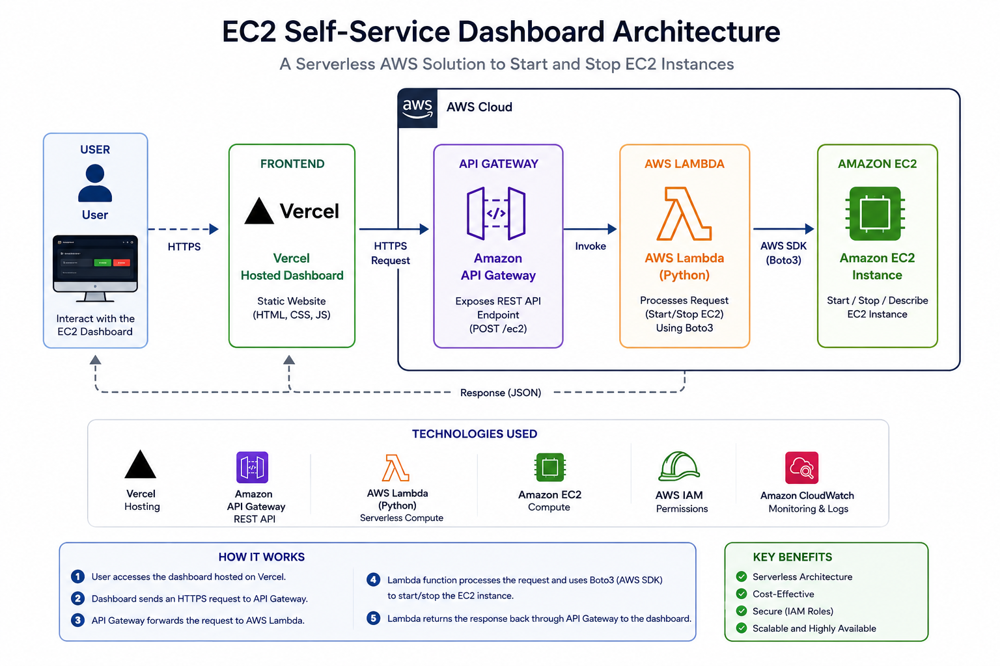
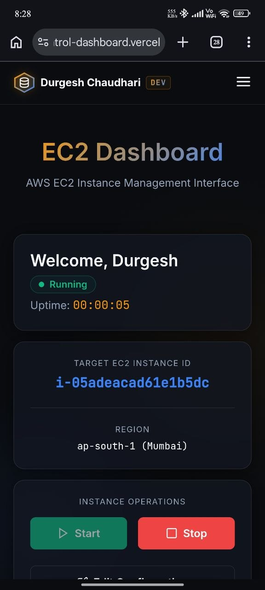
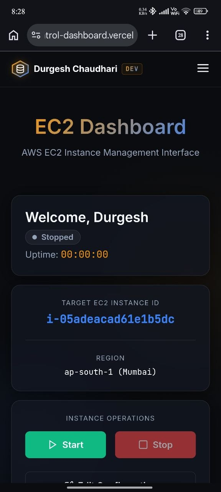
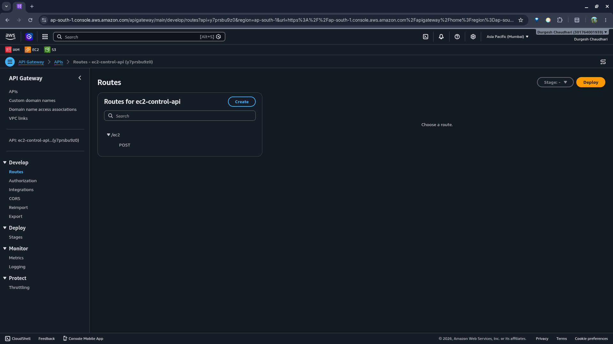
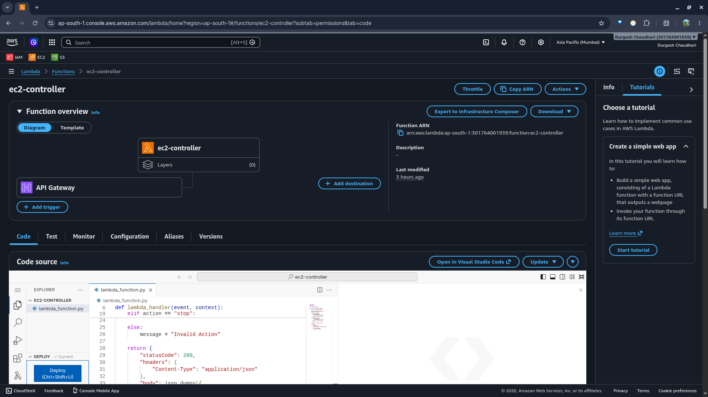
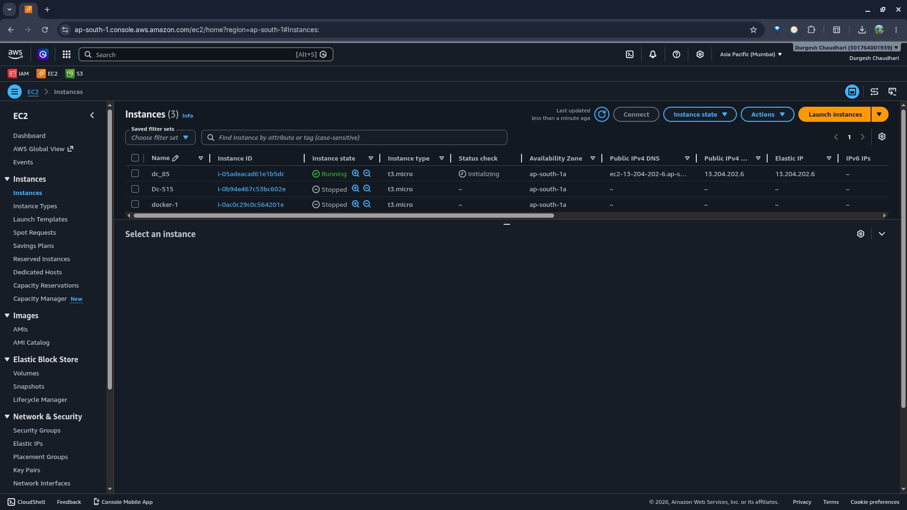

# 🚀 EC2 Self-Service Dashboard

<div align="center">

### Serverless AWS Cloud Project for EC2 Instance Management

Manage Amazon EC2 instances through a secure web dashboard without providing direct AWS Console access to developers.

🌐 **Live Demo**
https://ec2-control-dashboard.vercel.app


</div>

---

# 📌 Project Overview

Managing EC2 instances directly from the AWS Console can be inconvenient for developers who only need basic infrastructure control.

Providing AWS Console access to every developer also introduces unnecessary security risks.

This project solves that problem by providing a lightweight self-service dashboard that allows users to start and stop their assigned EC2 instances through a web interface.

The solution is built using a serverless AWS architecture powered by API Gateway, Lambda, IAM, and EC2.

---

# 🏗️ Architecture Diagram



---

# ⚙️ Architecture Flow

```text
User
   │
   ▼
Vercel Hosted Dashboard
   │
   ▼
Amazon API Gateway
   │
   ▼
AWS Lambda (Python)
   │
   ▼
Amazon EC2 Instance
```

---

# ✨ Key Features

✅ Start EC2 Instances

✅ Stop EC2 Instances

✅ Serverless AWS Architecture

✅ Mobile-Friendly Dashboard

✅ IAM Role-Based Access

✅ AWS API Integration

✅ Cloud Cost Optimization

✅ Fast and Lightweight User Interface

---

# 🛠️ AWS Services Used

| Service            | Purpose                |
| ------------------ | ---------------------- |
| Amazon EC2         | Compute Infrastructure |
| AWS Lambda         | Serverless Processing  |
| Amazon API Gateway | Secure API Endpoint    |
| AWS IAM            | Permission Management  |
| Vercel             | Frontend Hosting       |

---

# 🔄 Project Workflow

### Step 1

User accesses the dashboard hosted on Vercel.

### Step 2

The user enters an EC2 Instance ID.

### Step 3

The user clicks Start or Stop.

### Step 4

The dashboard sends an HTTPS request to Amazon API Gateway.

### Step 5

API Gateway invokes the AWS Lambda function.

### Step 6

Lambda communicates with EC2 using AWS SDK (Boto3).

### Step 7

The EC2 instance state changes accordingly.

### Step 8

A response is returned to the dashboard.

---

# 🔧 Lambda Function Logic

The Lambda function receives two parameters:

* `instance_id`
* `action`

Example Request:

```json
{
  "instance_id": "i-xxxxxxxxxxxxx",
  "action": "start"
}
```

Supported Actions:

* `start`
* `stop`

The function uses AWS SDK (Boto3) to communicate with Amazon EC2 and perform instance state changes.

---

# 🧪 Lambda Test Events

### Start Instance

```json
{
  "instance_id": "i-xxxxxxxxxxxxx",
  "action": "start"
}
```

### Stop Instance

```json
{
  "instance_id": "i-xxxxxxxxxxxxx",
  "action": "stop"
}
```

---

# 🚀 Deployment Steps

1. Create an Amazon EC2 instance.
2. Create an IAM role with EC2 Start/Stop permissions.
3. Create an AWS Lambda function.
4. Attach the IAM role to Lambda.
5. Create an API Gateway HTTP API.
6. Integrate API Gateway with Lambda.
7. Configure CORS for frontend communication.
8. Deploy the frontend dashboard on Vercel.
9. Connect the frontend with the API Gateway endpoint.

---

# 📂 Project Structure

```text
ec2-control-dashboard/
│
├── index.html
├── style.css
├── script.js
├── README.md
│
└── screenshots/
    ├── architecture-diagram.png
    ├── dashboard-running.png
    ├── dashboard-stopped.png
    ├── api-gateway.png
    ├── lambda-function.png
    └── ec2-instance-start.png
```

---

# 📸 Screenshots

## Dashboard (Running State)



---

## Dashboard (Stopped State)



---

## Amazon API Gateway



---

## AWS Lambda Function



---

## Amazon EC2 Instance



---

# 🔐 Security Implementation

### IAM Role-Based Access

The Lambda function is assigned an IAM role with permissions to:

* Start EC2 instances
* Stop EC2 instances

No AWS credentials are exposed in frontend code.

This follows AWS security best practices by avoiding hardcoded credentials.

---

# 💡 Skills Demonstrated

### AWS Cloud

* Amazon EC2
* AWS Lambda
* Amazon API Gateway
* AWS IAM

### Cloud Architecture

* Serverless Design
* API Integration
* Infrastructure Automation

### DevOps Fundamentals

* Git
* GitHub
* Vercel Deployment
* Cloud Resource Management

---

# 🚀 Future Enhancements

* Multi-Instance Management
* User Authentication
* CloudWatch Monitoring
* EventBridge Scheduled Automation
* Role-Based Access Control (RBAC)
* EC2 Status Detection
* Real-Time Metrics Dashboard

---

# 🎯 Learning Outcomes

Through this project, I gained hands-on experience with:

* Building serverless AWS solutions
* Integrating AWS services
* Managing IAM permissions
* Automating infrastructure operations
* Deploying production-style cloud applications

---

# 👨‍💻 Author

### Durgesh Chaudhari

Cloud & DevOps Enthusiast

🌐 Portfolio: https://durgeshdevportfolio.vercel.app

💻 GitHub: https://github.com/durgesh885

---

⭐ If you found this project interesting, feel free to explore the repository.
